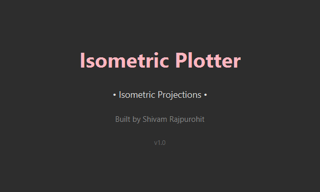
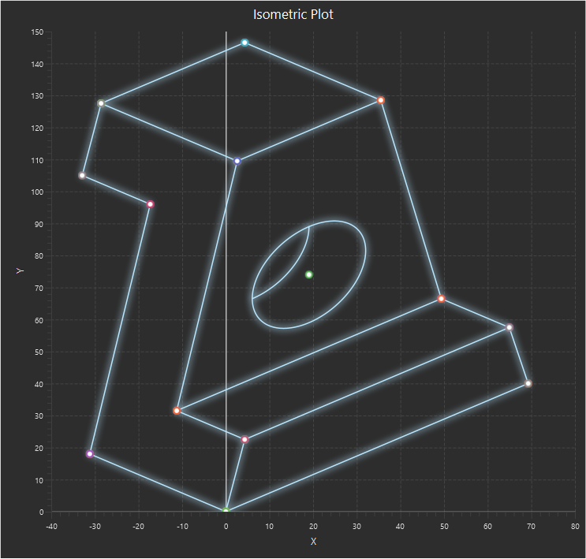
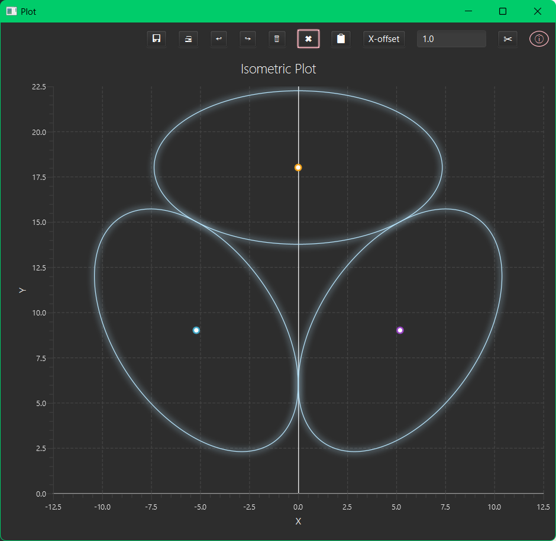
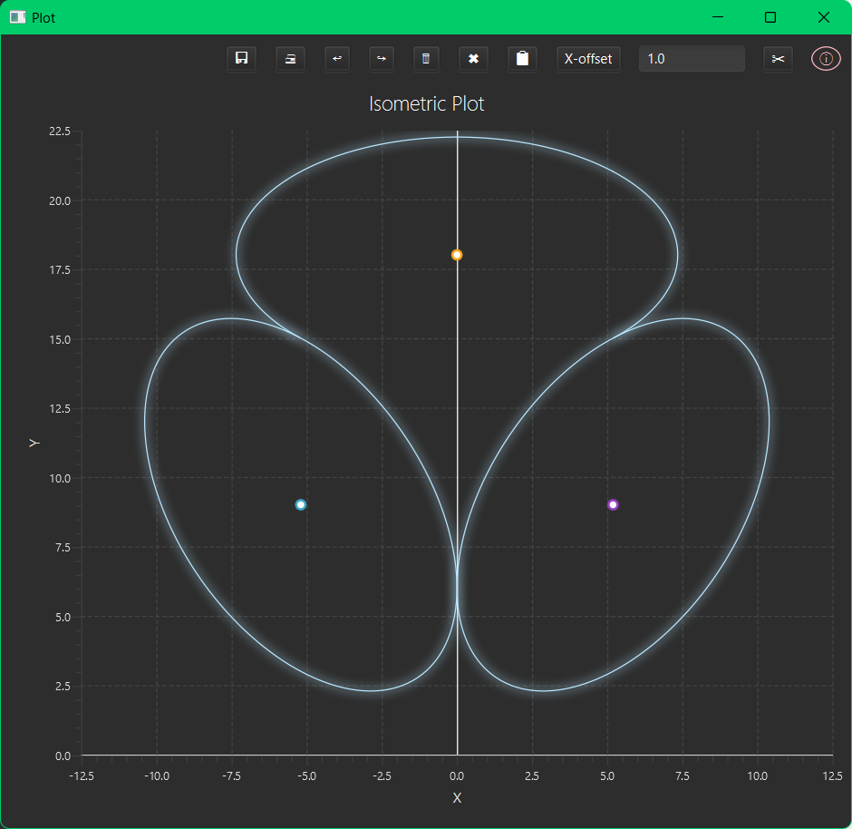
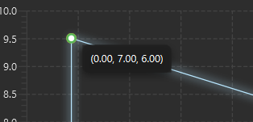
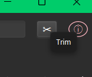

 # Iso-Plotter
Can be used to draw in Isometric view. Made in JavaFX

## Features
- **4 Shape Types**: Lines, Rectangles, Circles, Arcs
- **4 Planes**: Iso-top, Iso-left, Iso-right, Free Plane
- **Trim**: Click to delete segments between intersections
- **Copy**: Duplicate shapes with X/Y/Z offset
- **Undo/Redo**: Full history with trim support
- **Delete/Clear**: For managing drawings on the chart
- **Tooltips**: Hover for original 3D coordinates
- **Dark Mode**: Custom CSS with icy blue glow
- **Save/Print**: Export as PNG or print directly

## Screenshots

1. Sample drawing

2.Trim feature

3. Tooltips

## Getting Started
1. Open in BlueJ or any Java IDE
2. Run `SplashScreen.java`
3. Select shape type and method of plotting from dropdown
4. Enter coordinates in x,y,z format
5. Click Plot
6. Use the copy, delete and trim features to refine the drawing, or save and print
7. Trim may not work for very small figures. Use for slightly large fires or undo and try again

## Built With
- Java
- JavaFX
- Custom trim algorithm
- 2700 lines of code

## Built By
Shivam Rajpurohit — Chemical Engineering Student in 
June 2026 
